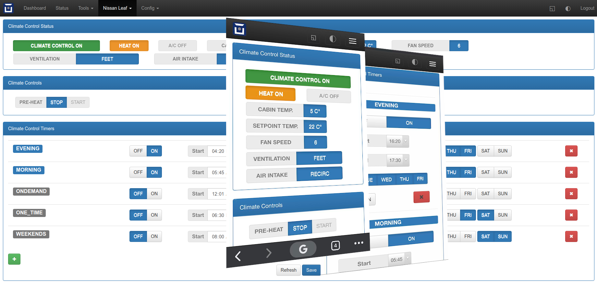

# Climate Control Timer Plugin for OVMS V3
Universal Climate Control Status & Pre-heat/cool timer Plugin for OVMS V3.

## Description
This plugin allows to start and stop climate control system of supported vehicles according to user defined schedule. Usually the built-in vehicle pre-heat/pre-cool funcitonality is limited to a few timers and to how long they can be running. Meanwhile this plugin allows to have unlimited number of timers as well as unlimited time period for keeping the climate control running.

WARNING: Running climate control system for a prolonged period will deplete your battery to the manufacturers set level. Make sure you understand the risks and set the timers wiseley.

The plugin was tested with Nissan Leaf 2013, but should work with any OVMS supported vehicles with working cliamte control functionality.

NOTE: Some metrics such as fan speed, setpoint temp. and ventilation status might not be supported by your vehicle, but you can still use the plugin for setting the climate control timers.

## Installation

Plugin requires back-end and front-end to work.
### Installing Back-end:
- place the cctimer.js file in /store/scripts/lib/
- add the following to /store/scripts/ovmsmain.js:
ccTimer = require("lib/cctimer")
ccTimer.ccTimerOn()
- script reload

To uninstall, reverse steps and reboot the device.

### Installing Front-end:
- In OVMS Web GUI go to config>Web Plugins.
- Click on + sign, type the desired name and click save.
- Select Page as type and click Edit on your new entry.
- Set desired Page, Label and Location in Menu.
- Set authorization to Cookie
- Paste the contents of cctimer-plugin.html to the Plugin content field and click save.

To uninstall, just remove the plugin in Web Plugins page.

## Usage 
- Timers can be added in GUI or with a command in shell or from the app. For example, the following command will add a new timer in enabled state that will be active from 7AM to 8AM on Monday and Wednesday:
"config set vehicle.cctimer 1-0700-0800-13"

## Behavior
- Script will check metrics for matching timers each 10 seconds as specified in checkIntervalMs variable and then will activate the remote heating/cooling using climatecontrol command. 
- with each check or timer on/off you will see a message in the OVMS event log.

NOTE: Never remove an active timer as the script will keep turning on the CC until you reboot the unit or reload js engine.

## Known Issues
- Save button in GUI sometimes does not save all the timers. In such cases it will show an error. Just retry and it will work.
- If you find anything else, please report here as issues.

## To-Do
- Automatically calculate climate control start time depending on ambient temperature.
- Add minimum SOC as an option for each timer.
