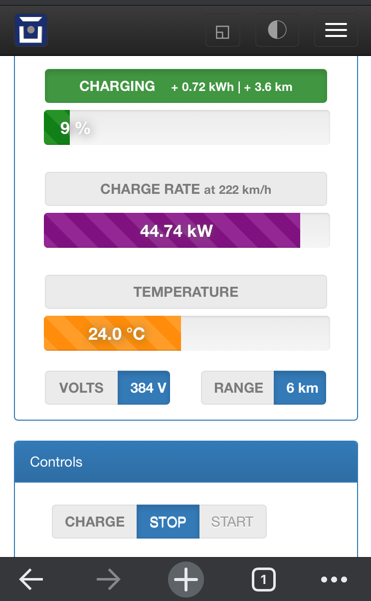

# Charging Monitor Plugin for OVMS V3

## Description
This plugin allows to see power delivered to the battery when charging. Currently it is configured for Nissan Leaf and the power bar will go to max 50kW.
The Plugin is currently in BETA state so the information may lag or be inaccurate. Still this is usefull on long trips when battery temperature needs to be optimal for fast charging.

## Installation

Plugin requires just a front-end to work.

### Installing Front-end:
- In OVMS Web GUI go to config>Web Plugins.
- Click on + sign, type the desired name and click save.
- Select Page as type and click Edit on your new entry.
- Set desired Page, Label and Location in Menu.
- Set authorization to None.
- Paste the contents of chargemon-plugin.html to the Plugin content field and click save.

To uninstall, just remove the plugin in Web Plugins page.

## Usage 
- The Interface also has a button to start or stop charging (if your vehicle supports this functionality).

## Known Issues
- Some values get stuck from time to time. Refresh the page to get updated information.
- If you find anything else, please report here as issues.

## To-Do
- Optimize GUI
